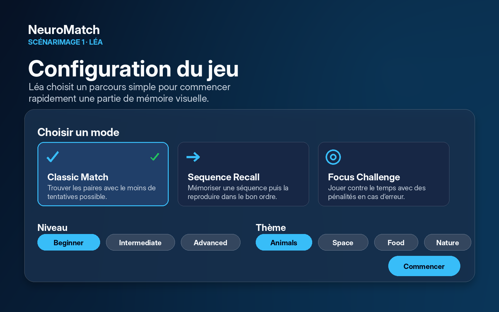
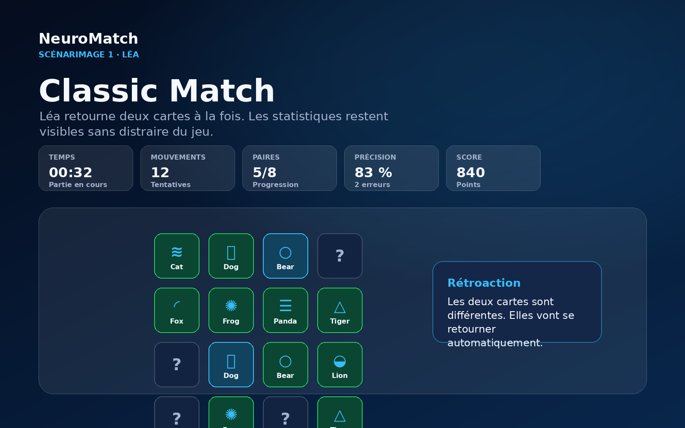
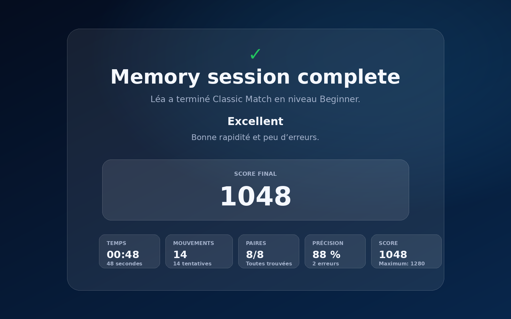
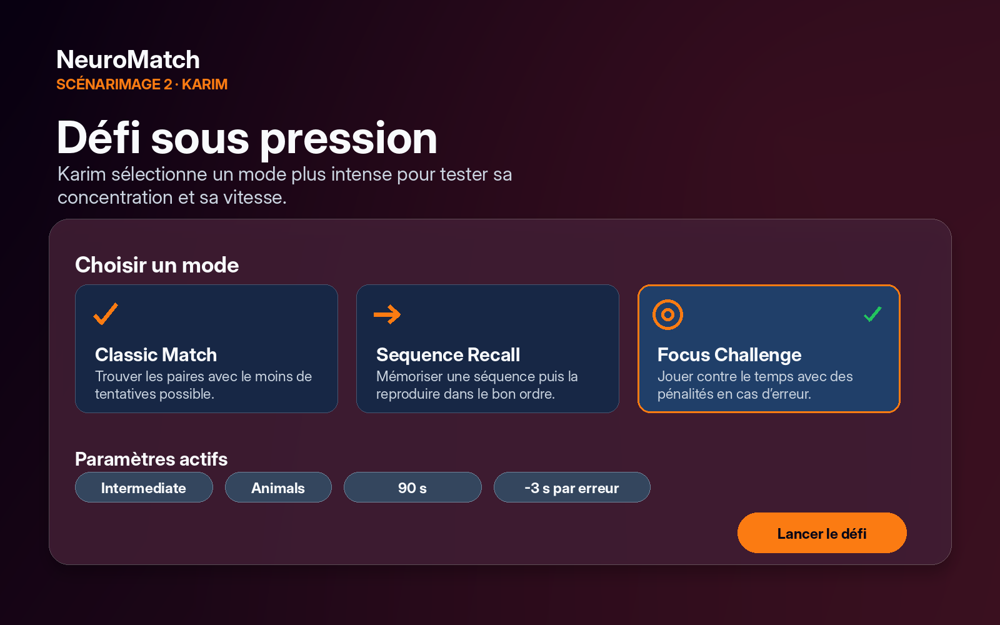
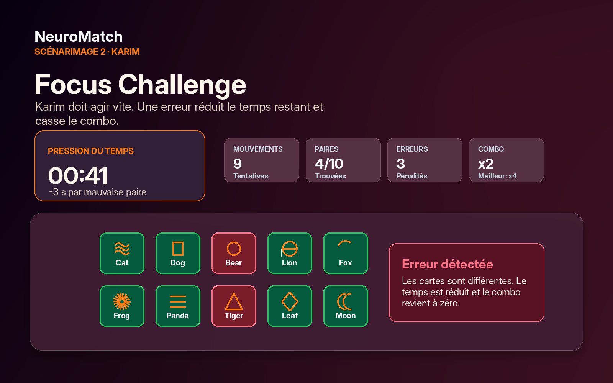
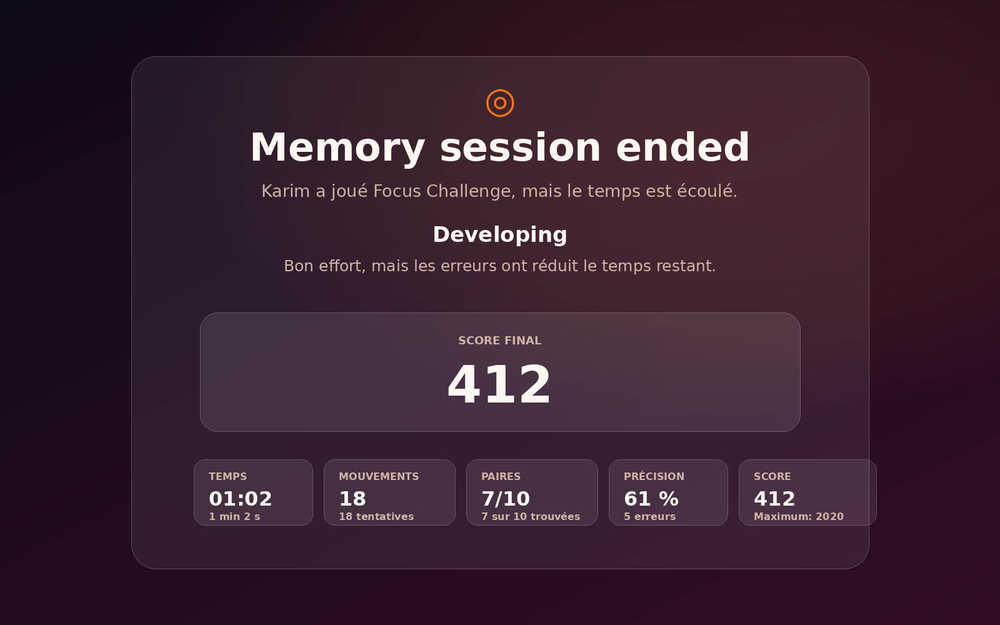
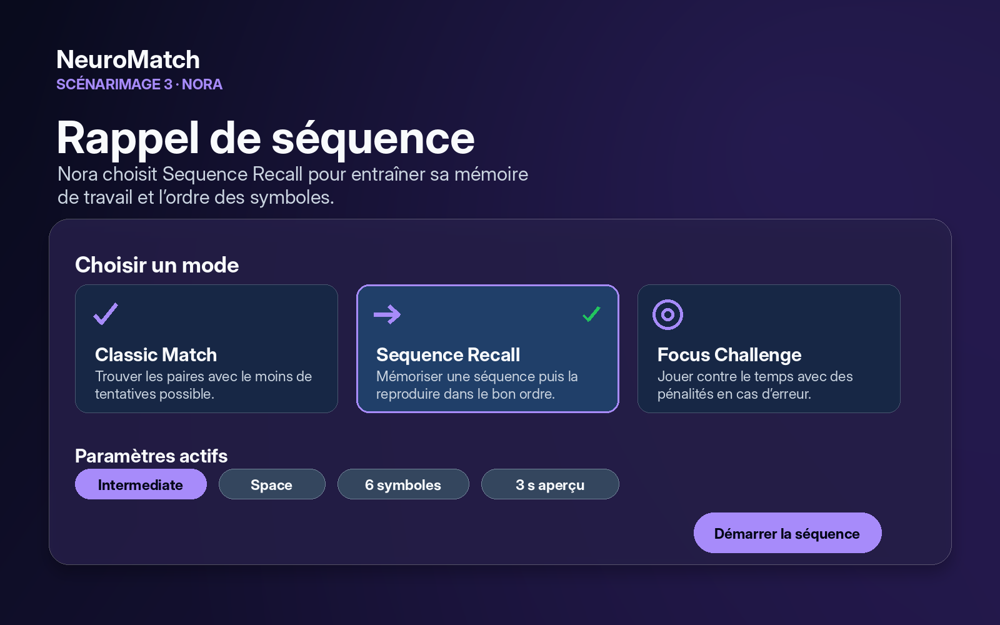
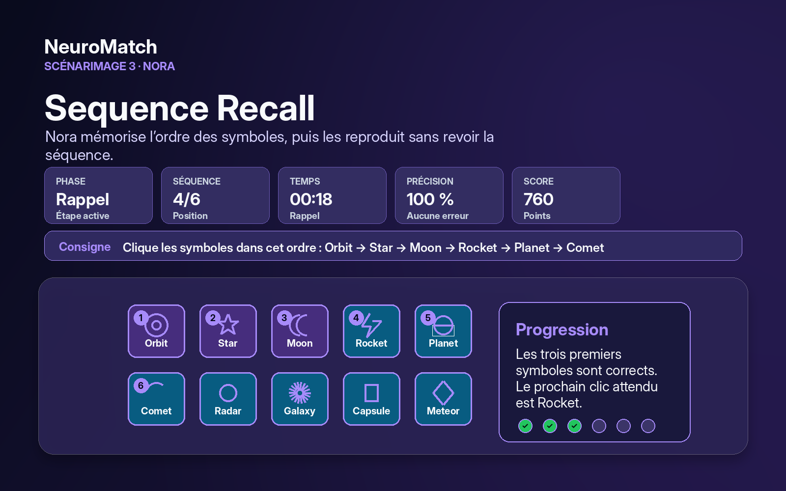
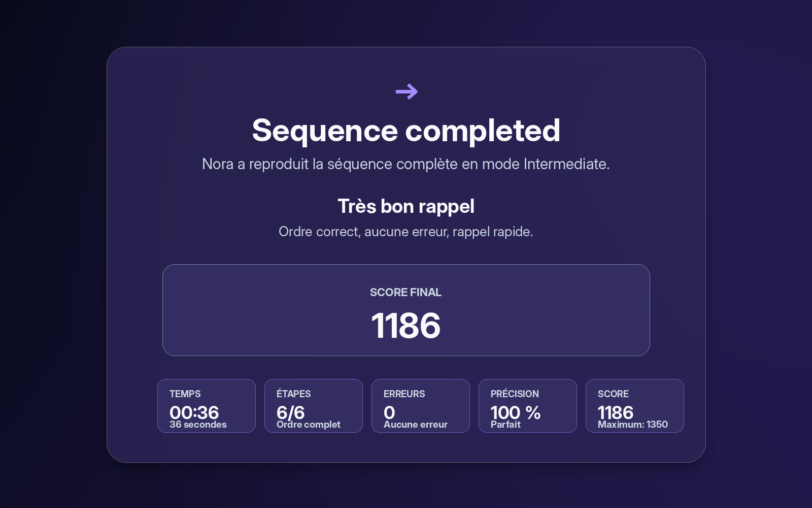
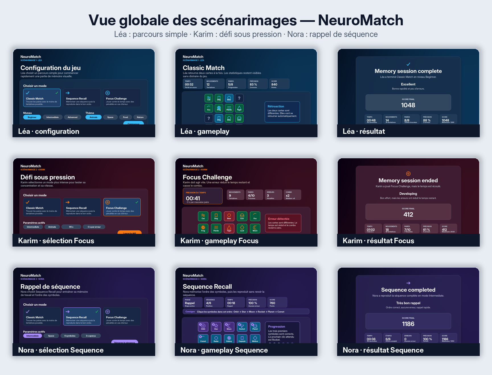

# Rapport — NeuroMatch

## 1. Concepteur

**Nom :** Mohamed Boudabbous
**Numéro d’étudiant :** 300376202
**Cours :** SEG3525

## 2. Jeu

**Nom du jeu :** NeuroMatch
**Type de jeu :** Jeu de mémoire interactif développé avec React

NeuroMatch est un prototype de jeu de mémoire conçu pour entraîner plusieurs aspects de la cognition humaine : la mémoire visuelle, le rappel de séquences, l’attention et la rapidité de décision.

Le jeu propose plusieurs modes interactifs. Le mode **Classic Match** demande au joueur de retrouver des paires de cartes. Le mode **Sequence Recall** demande de mémoriser une séquence de symboles puis de la reproduire dans le bon ordre. Le mode **Focus Challenge** ajoute une contrainte de temps et des pénalités en cas d’erreur.

Le jeu inclut aussi plusieurs niveaux de difficulté, des thèmes visuels configurables, un système de score, un écran de fin, une sauvegarde locale des meilleurs résultats et une interface responsive.

## 3. Inspirations

Pour concevoir NeuroMatch, j’ai exploré différents jeux de mémoire en ligne afin de comprendre leurs mécaniques principales et leurs limites d’interface.

### Inspiration 1 — Matching pairs

Le premier type de jeu observé est le jeu classique d’appariement de cartes. L’utilisateur retourne deux cartes et doit trouver les paires correspondantes. Cette logique a inspiré le mode **Classic Match** de NeuroMatch.

**Utilisation dans mon projet :**
Cette inspiration a été utilisée pour la mécanique principale du jeu : retourner des cartes, comparer deux symboles, valider les paires et compter les mouvements.

### Inspiration 2 — Simon Says / mémoire de séquence

Le deuxième type de jeu observé est le jeu de mémorisation de séquences, dans lequel l’utilisateur doit retenir un ordre d’éléments puis le reproduire.

**Utilisation dans mon projet :**
Cette inspiration a été utilisée pour le mode **Sequence Recall**, où le joueur observe une séquence de symboles pendant une courte période, puis doit cliquer les symboles dans le bon ordre.

### Inspiration 3 — Jeux de mémoire avec contrainte de temps

Le troisième type d’inspiration concerne les jeux qui ajoutent une pression temporelle afin de tester l’attention et la concentration.

**Utilisation dans mon projet :**
Cette idée a été utilisée dans le mode **Focus Challenge**, où le joueur doit retrouver les paires avant la fin du chronomètre. Les erreurs réduisent le temps restant, ce qui rend le mode plus exigeant.

## 4. Scénarimages avec maquettes

## a. Définition des trois personnages

### Personnage 1 — Léa Martin

Léa est une étudiante universitaire qui cherche un jeu rapide pour entraîner sa mémoire entre deux périodes d’étude. Elle n’a pas envie de lire de longues instructions et préfère une interface simple, claire et directe.

**Caractéristiques intrinsèques :**

* Elle aime les expériences rapides et faciles à comprendre.
* Elle se déconcentre rapidement si l’interface est trop chargée.
* Elle préfère les repères visuels clairs et les règles simples.

**Relation à la technologie :**
Léa utilise régulièrement des applications mobiles et des sites web, mais elle préfère les interfaces intuitives qui ne demandent pas beaucoup d’apprentissage.

**Relation au domaine :**
Elle connaît les jeux de mémoire classiques, mais elle ne veut pas un jeu trop complexe.

**Objectif :** jouer rapidement à un jeu de mémoire simple.
**Besoin principal :** comprendre immédiatement quoi faire.
**Solution proposée :** un mode Classic Match avec un niveau Beginner, une grille claire, des cartes visibles et un feedback immédiat.

### Personnage 2 — Karim Benali

Karim est un jeune professionnel qui aime les jeux de réflexion et les défis cognitifs. Il veut un jeu plus stimulant qui teste son attention, sa mémoire et sa rapidité.

**Caractéristiques intrinsèques :**

* Il aime se challenger et améliorer ses scores.
* Il est motivé par les statistiques de performance.
* Il aime les interfaces modernes avec un style plus immersif.

**Relation à la technologie :**
Karim est à l’aise avec les applications web interactives et comprend rapidement les mécaniques de jeu.

**Relation au domaine :**
Il aime les jeux de mémoire, mais il trouve souvent les versions classiques trop simples.

**Objectif :** tester sa concentration sous pression.
**Besoin principal :** avoir un défi plus intense avec score et progression.
**Solution proposée :** un mode Focus Challenge avec chronomètre, pénalités, combo, score et classement final.

### Personnage 3 — Nora Haddad

Nora est une étudiante qui veut entraîner sa mémoire de travail. Elle ne cherche pas seulement à retrouver des paires : elle veut retenir un ordre précis et vérifier si elle peut le reproduire sans se tromper.

**Caractéristiques intrinsèques :**

* Elle aime les exercices structurés avec des étapes claires.
* Elle se concentre mieux quand l’interface indique la phase active.
* Elle veut comprendre rapidement si son rappel est correct ou non.

**Relation à la technologie :**
Nora utilise facilement les applications interactives, mais elle a besoin d’un guidage clair quand une tâche comporte plusieurs phases.

**Relation au domaine :**
Elle connaît les jeux de mémoire classiques, mais elle veut une variante plus cognitive qui teste l’ordre, la concentration et la mémoire courte.

**Objectif :** mémoriser puis reproduire une séquence de symboles.
**Besoin principal :** voir clairement la phase de mémorisation, la phase de rappel et sa progression.
**Solution proposée :** un mode Sequence Recall avec aperçu temporaire, ordre à reproduire, indicateur d’étape, feedback progressif et score final.

## b. Scénarimage 1 — Léa : jouer rapidement en mode classique

Ce scénarimage représente le parcours d’une utilisatrice qui veut jouer rapidement à un jeu simple et clair.

### Maquette 1 — Écran de configuration

Léa arrive sur l’écran de configuration. Elle peut choisir le mode de jeu, le niveau de difficulté et le thème visuel. Le niveau Beginner et le thème Animals sont présentés comme des options simples et accessibles.



### Maquette 2 — Jeu en cours

Léa lance le mode Classic Match. Elle voit une grille de cartes, un compteur de temps, le nombre de mouvements, le nombre de paires trouvées et son score. Les cartes retournées donnent un feedback visuel immédiat.



### Maquette 3 — Résultat final

Lorsque Léa termine la partie, un écran de fin affiche son score, son temps, ses mouvements, sa précision et son rang. Cette rétroaction lui permet de comprendre sa performance et de rejouer pour s’améliorer.



## Scénarimage 2 — Karim : défi sous pression

Ce scénarimage représente le parcours d’un utilisateur qui cherche une expérience plus intense.

### Maquette 1 — Sélection du mode Focus

Karim choisit le mode **Focus Challenge**. L’interface met en avant le chronomètre, les pénalités et l’objectif de rapidité.



### Maquette 2 — Partie avec pression temporelle

Karim joue contre le chronomètre. Chaque erreur réduit le temps restant. L’interface affiche le temps, le nombre d’erreurs, la progression, le combo et le score.



### Maquette 3 — Fin du défi

À la fin du mode Focus Challenge, Karim voit un résumé de sa performance. Si le temps est écoulé avant d’avoir trouvé toutes les paires, l’écran indique clairement que le défi est terminé mais non complété.



## Scénarimage 3 — Nora : mémoriser une séquence

Ce scénarimage représente le parcours d’une utilisatrice qui veut entraîner sa mémoire de travail avec une tâche d’ordre séquentiel.

### Maquette 1 — Sélection du mode Sequence

Nora choisit le mode **Sequence Recall**. L’interface explique que le joueur doit mémoriser un ordre de symboles puis le reproduire dans le bon ordre.



### Maquette 2 — Rappel de la séquence

Nora passe à la phase de rappel. Elle voit les symboles disponibles, l’ordre attendu, sa position dans la séquence et un feedback de progression étape par étape.



### Maquette 3 — Résultat Sequence

À la fin du mode Sequence Recall, Nora voit son score, son temps, le nombre d’étapes réussies, ses erreurs et sa précision. Cette synthèse confirme si l’ordre complet a été reproduit correctement.



## Vue globale des scénarimages

L’image suivante montre les trois scénarimages exportés depuis Figma.



## 5. Prototype haute-fidélité

## a. Explication des choix de conception visuelle

Le prototype haute-fidélité a été conçu en React afin de transformer les scénarimages en une expérience interactive complète. Le jeu combine les besoins des trois personnages : simplicité pour Léa, défi sous pression pour Karim et rappel séquentiel pour Nora.

### Thème visuel

Le prototype utilise un thème sombre avec des couleurs d’accent lumineuses. Ce choix donne une impression moderne et technologique, tout en mettant l’attention sur les cartes, les icônes et les informations importantes.

Les couleurs d’accent changent selon le thème choisi. Par exemple, le thème Animals utilise une couleur vive qui contraste fortement avec l’arrière-plan sombre. Cette approche permet de garder une identité visuelle cohérente tout en offrant une configuration personnalisable.

### Typographie

La typographie utilise des titres larges et fortement contrastés pour guider l’attention de l’utilisateur. Les statistiques importantes comme le score, le temps, les paires trouvées et la précision sont affichées avec une taille plus grande pour être rapidement lisibles.

Les textes secondaires sont plus petits et moins contrastés afin de ne pas surcharger l’interface.

### Mise en page

La mise en page est organisée en plusieurs zones claires :

* un écran de configuration ;
* une zone de statistiques ;
* une zone de jeu ;
* une zone de feedback ;
* un écran de fin.

Cette organisation aide l’utilisateur à comprendre rapidement où regarder et quoi faire. L’espace négatif est utilisé pour éviter une interface trop dense, surtout dans les modes où la mémoire et l’attention sont sollicitées.

### Principes de Gestalt

Plusieurs principes de Gestalt ont été utilisés dans le prototype :

* **Proximité :** les informations liées sont regroupées dans des cartes de statistiques.
* **Similarité :** les cartes du jeu ont une forme et un style cohérents.
* **Figure-fond :** les cartes et les éléments actifs ressortent fortement sur le fond sombre.
* **Continuité :** les étapes de configuration guident naturellement l’utilisateur vers le bouton de démarrage.
* **Région commune :** les sections comme les modes, les niveaux et les thèmes sont séparées visuellement.

### Feedback utilisateur

Le prototype donne une rétroaction immédiate après chaque action :

* une carte se retourne lorsqu’elle est sélectionnée ;
* une paire correcte reste visible ;
* une erreur est signalée visuellement ;
* le score, les mouvements et la précision sont mis à jour ;
* l’écran de fin résume la performance.

Dans le mode Focus Challenge, la pression temporelle est renforcée par le chronomètre, les pénalités et les messages de feedback.

### Accessibilité

Le prototype utilise des boutons pour les cartes afin de conserver une navigation clavier naturelle. Les cartes possèdent aussi des labels accessibles. Les contrastes, les tailles de texte et les états visuels ont été pensés pour rendre l’interface plus lisible.

## b. Lien vers le portfolio

Le portfolio contient une carte de projet pour NeuroMatch, avec un lien vers le prototype interactif du jeu.

**Portfolio :**
https://portfoliov2mohamed.netlify.app

**Prototype NeuroMatch :**
https://portfoliov2mohamed.netlify.app/memory-game/dist/index.html

## 6. Code

Le code du jeu est disponible dans le dépôt GitHub suivant :

https://github.com/MohamedBoudabbous/portfolio-seg3525/tree/main/memory-game

## 7. Technologies utilisées

Le prototype a été développé avec les technologies suivantes :

* React
* Vite
* JavaScript
* HTML
* CSS
* localStorage
* Vitest pour les tests

Le projet utilise une structure de composants React afin de séparer l’interface, les données, les hooks de logique de jeu et les styles.

## 8. Fonctionnalités principales

NeuroMatch contient les fonctionnalités suivantes :

* trois modes de jeu : Classic Match, Sequence Recall et Focus Challenge ;
* trois niveaux de difficulté : Beginner, Intermediate et Advanced ;
* plusieurs thèmes visuels configurables ;
* cartes interactives avec animation de retournement ;
* compteur de temps ;
* compteur de mouvements ;
* compteur d’erreurs ;
* score final ;
* précision ;
* rang de performance ;
* sauvegarde locale des meilleurs scores ;
* écran de fin détaillé ;
* intégration au portfolio.

## 9. Tests

Des tests ont été ajoutés afin de vérifier certaines parties importantes du projet, notamment :

* le mélange des cartes ;
* la logique du reducer du jeu classique ;
* le calcul du score.

Les tests peuvent être lancés avec la commande suivante :

```bash
npm run test
```

Le projet peut être compilé avec :

```bash
npm run build
```

## 10. Reconnaissance de l’usage de l’IA

Dans ce projet, j’ai utilisé des outils d’intelligence artificielle générative comme aide pendant la conception et le développement.

L’IA a été utilisée pour m’aider à structurer certaines idées de scénarimages, proposer des formulations pour les personnages, améliorer la clarté de certaines explications et assister le débogage du prototype React.

L’IA a aussi été utilisée pour analyser certains problèmes techniques, notamment la logique de clic des cartes, les états React, le score, le mode Focus Challenge, le mode Sequence Recall et l’intégration du jeu dans le portfolio.

Cependant, les choix finaux, les modifications, les tests, l’intégration au portfolio et l’adaptation du design ont été réalisés et validés manuellement.

## 11. Liens complémentaires

**Portfolio :**
https://mohamedboudabbous.github.io/portfolio-seg3525/

**Prototype NeuroMatch :**
neuromatch-boudabbous-300376202.surge.sh

**GitHub :**
https://github.com/MohamedBoudabbous/portfolio-seg3525/tree/main/memory-game

**Figma — scénarimages :**
À ajouter lorsque le lien Figma final est disponible.
