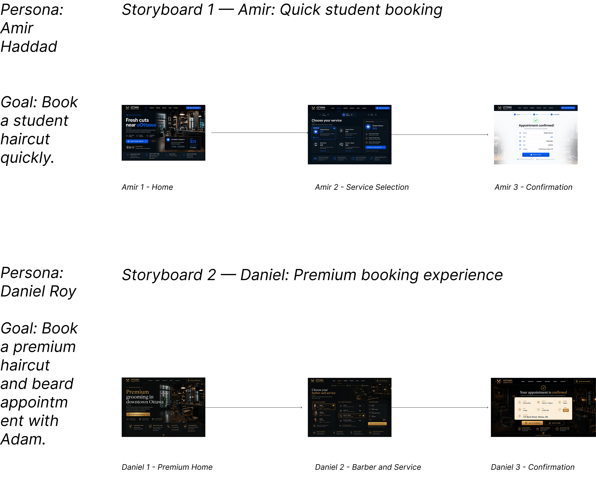

# Rapport — Ottawa Barber Studio

## 1. Concepteur

**Nom :** Mohamed Boudabbous  
**Numéro d’étudiant :** 300376202 
**Cours :** SEG3525  

## 2. Service

**Nom du service :** Ottawa Barber Studio  
**Type de service :** Site de réservation en ligne pour un salon de barbier  

Ottawa Barber Studio est un prototype de site de service permettant aux utilisateurs de réserver un rendez-vous dans un salon de barbier situé au centre-ville d’Ottawa. Le site permet de consulter les services, comparer les prix, choisir un barbier, sélectionner un créneau horaire et confirmer une réservation.

Le service a été conçu autour de deux besoins différents : une réservation rapide et abordable pour les étudiants, et une expérience plus premium pour les clients qui souhaitent un service complet.

## 3. Scénarimages avec maquettes

## a. Définition des deux personnages

### Personnage 1 — Amir Haddad

Amir est un étudiant universitaire à Ottawa. Il cherche une coupe de cheveux abordable près du campus et veut éviter de perdre du temps à appeler le salon. Il souhaite voir rapidement le prix, choisir un créneau disponible et confirmer sa réservation en quelques étapes simples.

**Objectif :** réserver rapidement une coupe étudiante.  
**Besoin principal :** un parcours simple, rapide et peu coûteux.  
**Solution proposée :** un parcours étudiant dédié, avec une interface bleue, un prix de 25 $ clairement affiché et une réservation rapide.

### Personnage 2 — Daniel Roy

Daniel est un client professionnel qui recherche une expérience de grooming plus premium. Il veut choisir son barbier, sélectionner un service complet de coupe et barbe, puis recevoir une confirmation détaillée de son rendez-vous.

**Objectif :** réserver une coupe et une barbe avec Adam.  
**Besoin principal :** une expérience plus complète, professionnelle et haut de gamme.  
**Solution proposée :** un parcours premium avec une interface noire et dorée, une sélection du barbier, une sélection du service et un résumé détaillé du rendez-vous.

## b. Scénarimage 1 — Amir : réservation étudiante rapide

Ce scénarimage représente le parcours d’un étudiant qui souhaite réserver une coupe rapidement.

### Maquette 1 — Accueil étudiant

Amir arrive sur une page qui met en avant une coupe étudiante, un prix abordable et une réservation rapide sans appel téléphonique.

### Maquette 2 — Sélection du service

Amir sélectionne le service **Student Haircut**. Le prix de 25 $ est immédiatement visible, ce qui réduit l’incertitude et facilite la décision.

### Maquette 3 — Confirmation

Amir confirme son rendez-vous. La confirmation affiche les informations essentielles : service, prix, date, heure et lieu.

## Scénarimage 2 — Daniel : expérience premium

Ce scénarimage représente le parcours d’un client qui recherche une expérience plus complète et plus professionnelle.

### Maquette 1 — Accueil premium

Daniel arrive sur une page visuellement plus luxueuse, avec un thème noir et doré. L’objectif est de communiquer une impression de qualité et de professionnalisme.

### Maquette 2 — Choix du barbier et du service

Daniel choisit son barbier, puis sélectionne le service **Haircut + Beard**. Un résumé du rendez-vous est affiché pour lui permettre de vérifier ses choix.

### Maquette 3 — Confirmation premium

Daniel obtient une confirmation détaillée de son rendez-vous. La présentation utilise une carte claire sur un fond sombre pour renforcer l’aspect premium.

## Vue globale des scénarimages

L’image suivante montre les deux scénarimages exportés depuis Figma.

## 4. Prototype haute-fidélité

## a. Explication des choix de conception visuelle

Le prototype haute-fidélité a été conçu en React afin de transformer les scénarimages en une expérience interactive. Le site propose deux parcours visuellement différents pour refléter les besoins des deux personnages.

### Parcours étudiant

Le parcours étudiant utilise principalement le bleu, le blanc et un fond sombre. Ce choix visuel donne une impression de rapidité, de modernité et d’accessibilité. Le prix de 25 $ est fortement mis en avant, car le coût est l’un des critères les plus importants pour Amir.

Le parcours étudiant est volontairement simplifié. L’utilisateur voit directement les informations principales : service, prix, jour, heure et confirmation. Cette approche réduit la charge cognitive et permet une réservation rapide.

### Parcours premium

Le parcours premium utilise une palette noire, dorée et beige. Ces couleurs donnent une impression de luxe, de qualité et de professionnalisme. Ce style correspond davantage au personnage de Daniel, qui veut une expérience plus complète et plus haut de gamme.

Dans ce parcours, l’utilisateur peut choisir un barbier, sélectionner un service et consulter un résumé de son rendez-vous avant de confirmer. Le design est plus détaillé afin de refléter une expérience plus personnalisée.

### Différences entre les deux parcours

Les deux scénarimages sont visuellement différents pour montrer deux types d’utilisateurs :

- Amir utilise un parcours rapide, bleu, simple et centré sur le prix étudiant.
- Daniel utilise un parcours premium, noir et doré, centré sur la qualité du service et la sélection du barbier.

### Similitudes entre les deux parcours

Malgré leurs différences visuelles, les deux parcours gardent une structure similaire :

- une page d’accueil claire ;
- une action principale visible ;
- une sélection de service ;
- un résumé du rendez-vous ;
- une page de confirmation.

Cette cohérence permet de garder une expérience utilisateur stable, tout en adaptant le style visuel aux besoins de chaque personnage.

## b. Lien vers le portfolio

Le portfolio contient une carte de projet pour Ottawa Barber Studio, avec un lien vers le site de service.

**Portfolio :**  
https://portfoliov2mohamed.netlify.app

**Site de service :**  
https://ottawa-barber-studio.netlify.app

## 5. Code

Le code du site de service est disponible dans le dépôt GitHub suivant :

https://github.com/MohamedBoudabbous/portfolio-seg3525/tree/main/service-site

## reconnaissance de l'usage de L'IA:

Dans ce projet, j’ai utilisé des outils d’intelligence artificielle générative comme aide à la génération des maquettes.
Les maquettes utilisées dans Figma ont été générées à partir de descriptions détaillées fournies sous forme de prompts. Ces prompts décrivaient le contexte du service, les objectifs des personnages, les éléments à afficher dans chaque maquette, ainsi que les styles visuels souhaités.

## Liens complémentaires

**Figma — scénarimages :**  
https://www.figma.com/design/pDe4pPhkQ0Sxo2zebhYCG7/Ottawa-Barber-Studio-%E2%80%93-Storyboards?node-id=5-31&t=DwkqF7odv3dhhn9d-1

**Portfolio :**  
https://portfoliov2mohamed.netlify.app

**Site Ottawa Barber Studio :**  
https://ottawa-barber-studio.netlify.app

**GitHub :**  
https://github.com/MohamedBoudabbous/portfolio-seg3525/tree/main/service-site