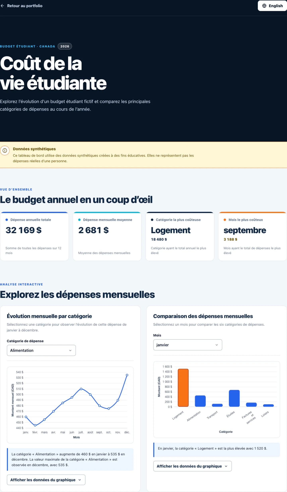

# Rapport — Tableau de bord du coût de la vie étudiante



## 1. Concepteur

**Nom :** Mohamed Boudabbous  
**Numéro d’étudiant :** 300376202  
**Cours :** SEG3525 — Conception et analyse d’interfaces usagers  
**Projet :** Devoir 5 — Tableau de bord interactif bilingue  
**Année des données :** 2026

## 2. Objectif du tableau de bord et données

### 2.1 Domaine choisi

**Nom du projet :** Coût de la vie étudiante  
**Domaine :** Budget et dépenses mensuelles d’un étudiant au Canada  
**Type d’interface :** Tableau de bord interactif bilingue français-anglais

Le tableau de bord permet d’explorer le budget annuel d’un étudiant fictif vivant de manière autonome au Canada. Il présente l’évolution mensuelle de six catégories de dépenses et permet de comparer leur importance pour chacun des douze mois de 2026.

Le projet répond à trois objectifs principaux :

    donner une vue d’ensemble rapide du budget annuel grâce à quatre indicateurs clés ;
    montrer l’évolution d’une catégorie de dépenses au cours de l’année ;
    comparer les six catégories pour un mois sélectionné.

Le public cible comprend les étudiants, les personnes qui préparent un budget d’études et les utilisateurs qui souhaitent comprendre la répartition générale de dépenses étudiantes.

### 2.2 Personas

Trois personas fictifs ont été définis afin de représenter différents usages possibles du tableau de bord. Ils servent à guider les choix d’interaction, de localisation, de lisibilité et d’accessibilité. Ils ne proviennent pas d’entrevues ou d’une étude menée auprès de personnes réelles.

#### Persona 1 — Amélie, étudiante vivant de manière autonome

**Âge :** 20 ans  
**Occupation :** Étudiante universitaire de première année  
**Langue préférée :** Français  
**Contexte :** Amélie vient de quitter le domicile familial et doit maintenant gérer seule son loyer, son alimentation, son transport et ses dépenses liées aux études.

**Objectif principal :** comprendre rapidement quelles catégories représentent la plus grande partie d’un budget étudiant annuel.

**Besoins :** Amélie veut consulter un résumé simple, comparer les dépenses mensuelles et observer comment une catégorie évolue pendant l’année. Elle préfère des montants clairement présentés en dollars canadiens et des explications qui ne nécessitent pas de connaissances en statistiques.

**Difficultés :** elle peut se sentir dépassée par un grand nombre de chiffres et ne sait pas toujours quelles données sont importantes.

**Utilisation du tableau de bord :** Amélie consulte d’abord les quatre indicateurs clés. Elle sélectionne ensuite « Alimentation » dans le graphique linéaire afin d’observer les variations mensuelles, puis utilise le résumé dynamique pour identifier le mois où cette dépense est la plus élevée.

**Influence sur la conception :** ce persona justifie la vue d’ensemble placée avant les graphiques, la hiérarchie visuelle claire, les descriptions en langage simple et les résumés textuels accompagnant les visualisations.

#### Persona 2 — Malik, étudiant international nouvellement arrivé au Canada

**Âge :** 24 ans  
**Occupation :** Étudiant international à la maîtrise  
**Langues utilisées :** Anglais et français  
**Contexte :** Malik vient d’arriver au Canada et cherche à comprendre les principales catégories qui composent un budget étudiant. Il utilise principalement son téléphone et alterne entre l’anglais et le français selon le contexte.

**Objectif principal :** comparer les catégories de dépenses d’un mois précis dans la langue qui lui convient.

**Besoins :** Malik a besoin d’un changement de langue rapide, de mois et de catégories traduits, de montants localisés en CAD et d’une interface utilisable sur petit écran.

**Difficultés :** des traductions incomplètes, des formats monétaires ambigus ou des graphiques trop larges pourraient nuire à sa compréhension.

**Utilisation du tableau de bord :** Malik passe l’interface en anglais, sélectionne septembre dans le graphique à barres et compare les six catégories. Il consulte ensuite le tableau accessible pour obtenir les valeurs exactes.

**Influence sur la conception :** ce persona justifie la localisation complète en `fr-CA` et `en-CA`, le bouton affichant la langue cible, la traduction des axes et des tooltips, ainsi que le responsive design sur mobile.

#### Persona 3 — Nadia, conseillère en services aux étudiants

**Âge :** 35 ans  
**Occupation :** Conseillère en aide financière et en services étudiants  
**Langue préférée :** Français, avec consultation occasionnelle de la version anglaise  
**Contexte :** Nadia accompagne des étudiants qui souhaitent mieux comprendre les catégories générales d’un budget. Elle utilise le tableau de bord comme exemple éducatif, tout en sachant que les données sont synthétiques.

**Objectif principal :** expliquer clairement la différence entre une tendance annuelle et une comparaison mensuelle.

**Besoins :** Nadia doit pouvoir montrer les valeurs exactes, identifier rapidement les dépenses maximales et rappeler la nature synthétique des données. Elle souhaite également naviguer au clavier lorsqu’elle présente l’interface.

**Difficultés :** une visualisation reposant uniquement sur les couleurs ou ne fournissant pas les valeurs exactes serait insuffisante pour ses explications.

**Utilisation du tableau de bord :** Nadia sélectionne différentes catégories dans le graphique linéaire, compare plusieurs mois dans le graphique à barres et ouvre les tableaux de données pour confirmer les valeurs affichées.

**Influence sur la conception :** ce persona justifie le bandeau d’avertissement visible, les tableaux accessibles, les résumés dynamiques, les états de focus, les libellés explicites et le fait que la couleur ne soit jamais le seul moyen de transmettre une information.

#### Outils utilisés pour les personas

Aucun outil de maquettage ou de création graphique de personas, comme Figma, Canva ou un générateur spécialisé, n’a été utilisé. Les personas ont été rédigés directement sous forme textuelle dans le rapport. ChatGPT/Codex a aidé à structurer et reformuler leur contenu, conformément à la reconnaissance de l’usage de l’IA générative présentée à la section 6. Les profils finaux ont ensuite été relus et adaptés aux fonctionnalités réelles du tableau de bord.

### 2.3 Jeu de données

Le jeu de données est **entièrement synthétique**. Il a été créé avec l’aide de l’intelligence artificielle générative pour ce prototype éducatif et ne provient pas d’une personne réelle ni d’une source statistique officielle.

Cette information est communiquée de plusieurs façons :

    un bandeau « Données synthétiques » est immédiatement visible sous le header ;

    le footer rappelle que le prototype utilise exclusivement des données synthétiques ;

    les métadonnées du code indiquent `synthetic: true` et `sourceType: "synthetic"` ;

    le présent rapport décrit explicitement l’origine des données.

Le jeu contient douze observations mensuelles et six catégories :

| Clé technique | Catégorie française | Catégorie anglaise |
|---|---|---|
| `housing` | Logement | Housing |
| `food` | Alimentation | Food |
| `transportation` | Transport | Transportation |
| `education` | Études | Education |
| `utilities` | Factures et services | Utilities and services |
| `leisure` | Loisirs | Leisure |

Tous les montants sont exprimés en dollars canadiens (CAD).

### 2.4 Structure et ajustements des données

Les données ont été structurées dans `student-cost-dashboard/src/data/costData.js`. Chaque observation possède un identifiant stable, un numéro de mois et une valeur numérique pour chacune des six catégories.

    Les valeurs ont été ajustées afin de former un scénario crédible et compréhensible :

    le logement demeure relativement stable, avec une augmentation à partir de septembre ;

    l’alimentation varie légèrement au cours de l’année ;

    le transport diminue pendant l’été ;

    les dépenses d’études augmentent au début des trimestres, surtout en janvier, mai et septembre ;

    les factures et services varient selon les saisons ;

    les loisirs augmentent pendant l’été et en décembre ;

    aucune valeur n’est négative ;

    chaque mois contient exactement les six catégories.

Les totaux ne sont pas dupliqués dans le jeu de données. Ils sont calculés dynamiquement afin d’éviter les incohérences.

### 2.5 Résultats principaux

Les fonctions statistiques du prototype produisent les résultats suivants :

| Indicateur | Résultat |
|---|---:|
| Dépense annuelle totale | 32 169 $ |
| Dépense mensuelle moyenne | 2 681 $ |
| Catégorie la plus coûteuse | Logement — 18 480 $ |
| Mois le plus coûteux | Septembre — 3 188 $ |

Ces valeurs sont calculées à partir des observations mensuelles et ne sont pas codées directement dans les composants de l’interface.

### 2.6 Inspirations et références

Le projet ne reproduit pas un tableau de bord existant. La conception a surtout été guidée par les principes présentés dans le cours, dans l’énoncé du Devoir 5 et dans le tutoriel fourni sur les tableaux de bord bilingues.

Les références techniques suivantes ont également servi à vérifier les conventions d’implémentation :

[Chart.js — Line Chart](https://www.chartjs.org/docs/latest/charts/line.html)

[Chart.js — Bar Chart](https://www.chartjs.org/docs/latest/charts/bar.html)

[MDN — Intl.NumberFormat](https://developer.mozilla.org/fr/docs/Web/JavaScript/Reference/Global_Objects/Intl/NumberFormat)

Ces références ont été utilisées pour les graphiques et la localisation. Elles ne constituent pas la source des données.

## 3. Réflexion et conception

### 3.1 Choix des graphiques

#### Graphique 1 — Graphique linéaire

Le premier graphique présente l’évolution mensuelle d’une catégorie de dépenses de janvier à décembre.

**Type choisi :** graphique linéaire (`line chart`).

**Justification :** une ligne facilite la lecture d’une tendance dans le temps. Elle permet de repérer les hausses, les baisses, les périodes stables et le mois où la valeur maximale est observée.

**Interaction :** l’utilisateur sélectionne l’une des six catégories dans un menu déroulant. La courbe, les tooltips, le résumé textuel et le tableau de données sont alors mis à jour.

#### Graphique 2 — Graphique à barres

Le second graphique compare les six catégories de dépenses pour un mois choisi.

**Type choisi :** graphique à barres (`bar chart`).

**Justification :** des barres partant d’une même ligne de base permettent de comparer rapidement des catégories distinctes. La hauteur des barres rend la différence entre le logement, l’alimentation, le transport, les études, les factures et les loisirs immédiatement perceptible.

**Interaction :** l’utilisateur sélectionne l’un des douze mois. Les six barres, le résumé dynamique et le tableau accessible sont recalculés pour ce mois.

La catégorie la plus élevée est affichée en orange, tandis que les autres catégories sont affichées en bleu.

### 3.2 Application des 3Cs

#### Contexte

Chaque graphique fournit les informations nécessaires pour comprendre ce qui est présenté :

    un titre précis ;

    une description de l’objectif du graphique ;

    un contrôle clairement étiqueté ;

    des axes nommés et traduits ;

    la devise CAD ;

    des tooltips localisés ;

    un résumé dynamique exprimant l’observation principale ;

    un tableau accessible contenant les valeurs exactes.

Le header précise que le tableau de bord concerne un budget étudiant canadien en 2026. Le bandeau synthétique définit aussi clairement la nature des données.

#### Clutter-free

Le design limite les éléments qui ne contribuent pas à la compréhension :

    aucun effet 3D ;

    aucune texture ou décoration superflue ;

    grilles légères ;

    légendes retirées lorsqu’elles seraient redondantes ;

    une seule série dans le graphique linéaire ;

    palette restreinte et cohérente ;

    espace négatif suffisant entre les sections ;

    détails numériques placés dans les tooltips, les résumés et les tableaux plutôt que répétés sur chaque point.

#### Contraste

Le contraste sert à guider l’attention :

    le bleu identifie les données principales et les actions ;

    l’orange met en évidence la catégorie mensuelle la plus élevée ;

    le texte bleu marine ressort sur les surfaces blanches ;

    le bandeau jaune distingue immédiatement l’avertissement sur les données ;

    un contour de focus cyan très visible facilite la navigation au clavier.

La couleur n’est jamais le seul moyen de transmettre une information. Le résumé textuel et le tableau indiquent aussi explicitement la valeur et la catégorie maximales.

### 3.3 Mise en page, titre et interactions

Le titre principal « Coût de la vie étudiante » indique directement le domaine. Le sous-titre explique que l’utilisateur peut explorer un budget fictif et comparer ses principales catégories.

La page suit une progression simple :

1. header et changement de langue ;
2. avertissement sur les données synthétiques ;
3. indicateurs clés ;
4. graphiques interactifs ;
5. résumés et tableaux accessibles ;
6. footer et retour au portfolio.

Les quatre indicateurs permettent une lecture globale avant l’analyse détaillée. Les deux graphiques sont ensuite placés côte à côte sur grand écran afin de faciliter leur comparaison.

Les principales interactions sont :

    choisir l’une des six catégories du graphique linéaire ;
    choisir l’un des douze mois du graphique à barres ;
    afficher ou masquer les tableaux de données ;
    passer instantanément du français à l’anglais ;
    retourner au portfolio dans la langue correspondante.

Les contrôles sont placés avant les graphiques afin que l’utilisateur choisisse d’abord le paramètre, puis observe immédiatement le résultat.

### 3.4 Internationalisation et localisation

#### Langues choisies

Le prototype est disponible en français et en anglais. Le français est la langue par défaut.

Les traductions ont été rédigées avec l’aide de ChatGPT/Codex, puis relues et adaptées au contexte du tableau de bord. Les deux langues utilisent la même structure de clés dans `src/i18n/translations.js`.

#### Éléments localisés

La localisation couvre :

    le titre de l’onglet et la métadescription ;
    le header, le sous-titre et la navigation ;
    l’avertissement synthétique ;
    les quatre indicateurs clés ;
    les catégories et les douze mois ;
    les titres, descriptions et contrôles des graphiques ;
    les axes et les tooltips Chart.js ;
    les résumés dynamiques ;
    les captions et en-têtes des tableaux ;
    les textes d’accessibilité ;
    le footer et les liens vers le portfolio.

Lorsque la langue change, l’application met également à jour :

    l’attribut `<html lang>` ;
    `document.title` ;
    la métadescription ;
    le format monétaire ;
    les graphiques et leurs attributs accessibles.

#### Formatage localisé

Le prototype utilise les API natives `Intl.NumberFormat` et `Intl.DateTimeFormat` avec des locales explicites :

    `fr-CA` pour le français ;
    `en-CA` pour l’anglais.

Exemple de format monétaire :

    français : `1 600 $` ;
    anglais : `$1,600`.

#### Difficultés rencontrées

Les principales difficultés d’internationalisation concernaient :

    la longueur différente des libellés, par exemple « Factures et services » et « Utilities and services » ;
    le positionnement du symbole monétaire ;
    les abréviations des mois sur les axes ;
    la traduction des tooltips générés par Chart.js ;
    le maintien d’une largeur suffisante pour les boutons et les menus sur mobile ;
    la mise à jour de textes qui ne se trouvent pas directement dans le DOM React, comme le titre du document.

Ces problèmes ont été traités avec une mise en page flexible, des libellés d’axes pouvant occuper plusieurs lignes, des ressources centralisées et des fonctions de formatage réutilisables.

## 4. Prototype haute-fidélité

Le tableau de bord a été développé avec React, Vite, Chart.js et `react-chartjs-2`. Il s’agit d’un prototype fonctionnel : les menus modifient réellement les graphiques, les résumés et les tableaux.

### 4.1 Choix de conception visuelle

#### Palette

La palette combine :

    bleu marine pour le header, le footer et les titres importants ;
    bleu pour les données principales et les actions ;
    orange pour mettre en évidence la valeur maximale ;
    jaune pâle pour l’avertissement synthétique ;
    surfaces blanches sur un arrière-plan gris très clair.

Cette palette établit une hiérarchie claire tout en conservant un style sobre adapté à un tableau de bord éducatif.

#### Typographie

La hiérarchie typographique distingue clairement :

    le titre principal ;
    les titres de sections ;
    les valeurs des indicateurs ;
    les titres des graphiques ;
    les descriptions et métadonnées secondaires.

Les nombres importants utilisent une taille et un poids plus élevés afin de permettre une lecture rapide.

#### Gestalt et organisation

Plusieurs principes de Gestalt ont guidé la composition :

    **proximité :** le titre, la description, le contrôle, le graphique et le résumé sont regroupés dans une même carte ;
    **similarité :** les indicateurs et les cartes graphiques partagent une structure cohérente ;
    **région commune :** les bordures et surfaces délimitent les groupes d’information ;
    **continuité :** l’ordre vertical guide l’utilisateur de la synthèse vers l’analyse détaillée ;
    **figure-fond :** les cartes blanches ressortent clairement sur l’arrière-plan gris pâle.

### 4.2 Responsive design

La mise en page s’adapte aux différentes tailles d’écran :

    quatre indicateurs par rangée sur grand écran ;
    deux indicateurs par rangée sur tablette ;
    un indicateur par rangée sur petit écran ;
    deux graphiques côte à côte sur grand écran ;
    un graphique par rangée sur tablette et mobile ;
    contrôles et navigation empilés lorsque l’espace devient insuffisant ;
    tableaux placés dans une zone à défilement horizontal interne.

Le prototype a été vérifié aux largeurs de 1440, 1024, 768, 390 et 320 pixels.

### 4.3 Accessibilité

Le prototype inclut notamment :

    un lien d’évitement vers le contenu principal ;
    une structure HTML sémantique ;
    des labels associés aux menus ;
    des états de focus visibles ;
    des noms accessibles traduits pour les graphiques ;
    des régions `aria-live` pour les informations dynamiques ;
    un résumé textuel pour chaque visualisation ;
    un tableau correspondant à chaque graphique ;
    des `<caption>` et des en-têtes `<th>` ;
    une utilisation complète au clavier ;
    une prise en charge de `prefers-reduced-motion` ;
    des styles pour le mode de couleurs forcées ;
    une information maximale transmise autrement que par la couleur seule.

### 4.4 Indicateurs d’utilisabilité

| Heuristique de Nielsen | Application dans le prototype |
|---|---|
| Visibilité de l’état du système | Les contrôles conservent la sélection active et les graphiques, résumés et tableaux se mettent à jour immédiatement. |
| Correspondance avec le monde réel | Le vocabulaire utilise des mois, des catégories budgétaires et la devise CAD. |
| Contrôle et liberté | L’utilisateur peut changer de catégorie, de mois, de langue et ouvrir ou fermer les données détaillées. |
| Cohérence et standards | Les cartes, contrôles, boutons, couleurs et espacements utilisent les mêmes conventions. |
| Prévention des erreurs | Les valeurs de sélection sont validées avant de modifier l’état et des états vides sont prévus. |
| Reconnaissance plutôt que rappel | Les options, unités, titres et sélections restent visibles. |
| Flexibilité et efficacité | Les menus permettent de passer directement à n’importe quelle catégorie ou n’importe quel mois. |
| Design esthétique et minimaliste | Les graphiques évitent le 3D, les légendes redondantes et les décorations inutiles. |
| Reconnaissance et correction des erreurs | Des messages d’indisponibilité sont prévus lorsque les données attendues sont absentes. |
| Aide et documentation | Les descriptions, avertissements, résumés et tableaux expliquent le contenu sans documentation externe. |

### 4.5 Liens publics

#### Portfolio

[Portfolio français — GitHub Pages](https://mohamedboudabbous.github.io/portfolio-seg3525/)

[Portfolio anglais — GitHub Pages](https://mohamedboudabbous.github.io/portfolio-seg3525/en/index.html)

#### Études de cas

[Étude de cas française](https://mohamedboudabbous.github.io/portfolio-seg3525/student-cost-dashboard.html)

[English case study](https://mohamedboudabbous.github.io/portfolio-seg3525/en/student-cost-dashboard.html)

#### Prototype interactif

[Tableau de bord — GitHub Pages](https://mohamedboudabbous.github.io/portfolio-seg3525/student-cost-dashboard/dist/index.html)

[Miroir du portfolio — Surge](https://portfolio-seg3525-mohamed-boudabbous.surge.sh/)

[Miroir du tableau de bord — Surge](https://portfolio-seg3525-mohamed-boudabbous.surge.sh/student-cost-dashboard/dist/index.html)

GitHub Pages constitue l’hébergement principal. Surge fournit une copie publique de secours.

## 5. Code source

Le code est disponible dans le dépôt suivant :

[Dépôt GitHub — portfolio-seg3525](https://github.com/MohamedBoudabbous/portfolio-seg3525)

[Code source du tableau de bord](https://github.com/MohamedBoudabbous/portfolio-seg3525/tree/main/student-cost-dashboard)

### 5.1 Technologies utilisées

    React 19
    React DOM 19
    Vite 8
    Chart.js 4
    `react-chartjs-2` 5
    JavaScript
    HTML5
    CSS3
    API `Intl`
    Oxlint avec règles d’accessibilité JSX
    Git et GitHub
    GitHub Pages
    Surge comme hébergement miroir

### 5.2 Architecture principale

```text
student-cost-dashboard/
├── dist/                         # version compilée publiée
├── public/
│   └── favicon.svg
├── src/
│   ├── components/
│   │   ├── AccessibleDataTable.jsx
│   │   ├── ChartCard.jsx
│   │   ├── DataWarning.jsx
│   │   ├── ExpenseTrendChart.jsx
│   │   ├── Footer.jsx
│   │   ├── Header.jsx
│   │   ├── MetricCard.jsx
│   │   ├── MonthlyComparisonChart.jsx
│   │   └── SummaryCards.jsx
│   ├── config/
│   │   ├── chartSetup.js
│   │   └── navigation.js
│   ├── data/
│   │   └── costData.js
│   ├── i18n/
│   │   └── translations.js
│   ├── utils/
│   │   ├── formatters.js
│   │   └── statistics.js
│   ├── App.jsx
│   ├── main.jsx
│   └── styles.css
├── package.json
└── vite.config.js
```

### 5.3 Exécution locale

```bash
cd student-cost-dashboard
npm install
npm run dev
```

### 5.4 Vérification technique

```bash
npm run lint
npm run build
npm run preview
```

Le lint est configuré pour refuser les avertissements. Le build Vite utilise des chemins d’assets relatifs afin que le tableau de bord fonctionne dans un sous-dossier du portfolio.

## 6.  Reconnaissance de l’usage de l’IA générative


Dans ce projet, j’ai utilisé des outils d’intelligence artificielle générative comme aide pendant le travail.

L’IA a été utilisée pour :

- générer et ajuster le jeu de données synthétique ;
- Structurer certaines idées du rapport
- Aider au débogage du code React
- Vérifier que les exigences du devoir étaient couvertes

Cependant, les choix finaux de conception, l’intégration au portfolio, la sélection du thème, l’organisation du prototype et les décisions finales ont été faits par moi.


## 7. Validation finale

Le prototype final respecte les exigences principales du Devoir 5 :

    [x] framework JavaScript React ;
    [x] graphique linéaire et graphique à barres ;
    [x] une interaction fonctionnelle par graphique ;
    [x] interface bilingue français-anglais ;
    [x] axes, tooltips, contrôles et tableaux localisés ;
    [x] bandeau visible indiquant les données synthétiques ;
    [x] design responsive ;
    [x] fonctions d’accessibilité complémentaires ;
    [x] prototype hébergé publiquement ;
    [x] tableau de bord relié au portfolio ;
    [x] code source disponible sur GitHub ;
    [x] portfolio révisé avec des images finales.

## 8. Conclusion

Le tableau de bord du coût de la vie étudiante présente un budget fictif dans une interface claire, interactive, bilingue et responsive. Le graphique linéaire répond à une question d’évolution dans le temps, tandis que le graphique à barres répond à une question de comparaison entre catégories.

Le projet m’a permis d’appliquer concrètement les 3Cs, les principes de hiérarchie visuelle, les heuristiques d’utilisabilité, l’accessibilité des visualisations et la localisation complète d’une interface React. Son intégration au portfolio final montre aussi l’évolution de mes compétences en conception d’interfaces au cours de SEG3525.
